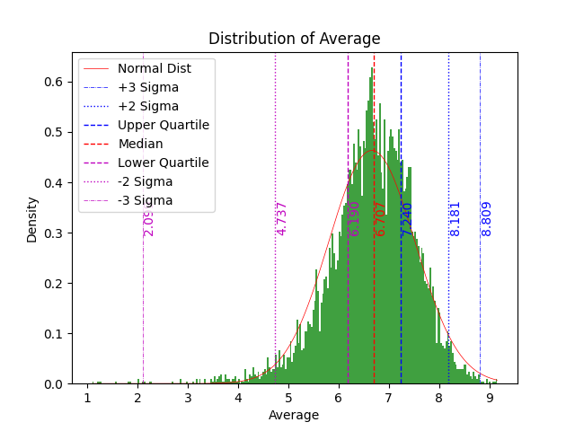
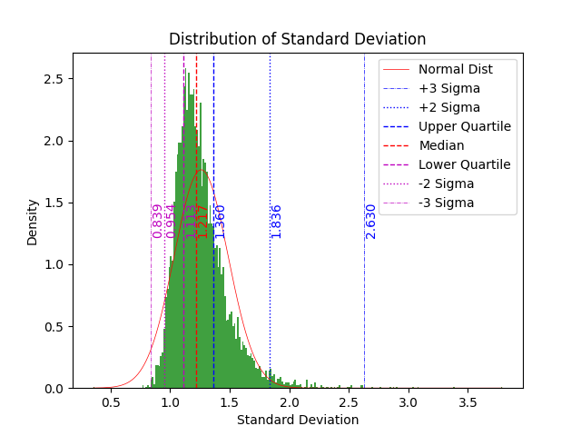
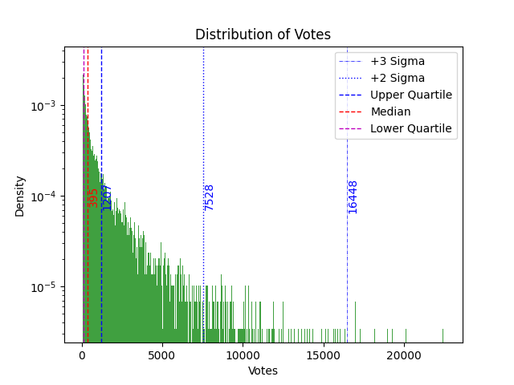
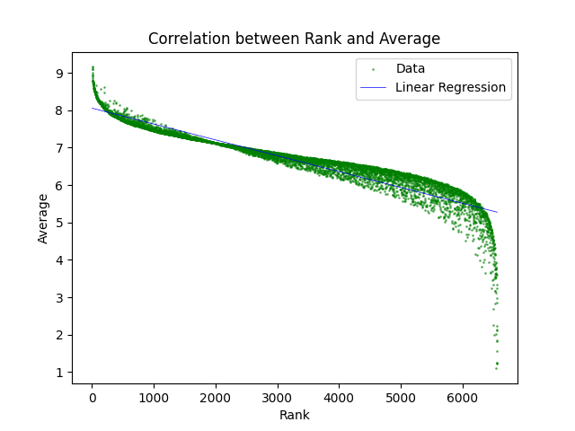
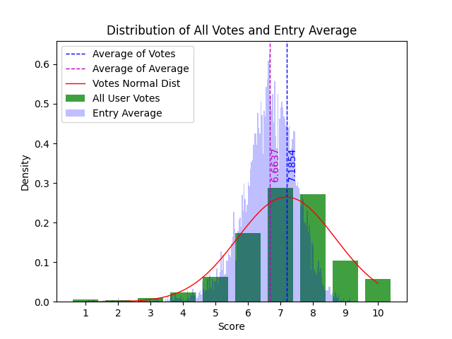

# Bangumi Anime Ranking

Yet another [Bangumi](https://bgm.tv/) anime ranking analysis project.

- Data Last Updated: 2023-04-30
- Analysis Last Updated: 2023-05-01
- Entries: 6565 (= 7673 all ranked animes - 1108 restricted entries)
- As there are too many files, you cannot preview all of them on Github. Clone this repo and view the files locally.
- Enjoys!

## PONet Ranking

A side project for better ranking.

- Theory: [a simplified ranking system based on partial order network](https://bgm.tv/group/topic/371075). The ranking is based on **how a specific user votes different entries**, instead of *how a specific entry is voted by different users*.
- Dataset: [Bangumi15M](https://www.kaggle.com/datasets/klion23/bangumi15m), contains 8573 valid entries (including restricted ones) and 7,770,854 valid votes.
- Data Last Updated: 2023-05-09
- Analysis Last Updated: 2023-06-01
- See [ponet.md](ponet.md) for more details.

## Usage

### Requirements

Python 3.6+ is required. You can install the dependencies by running the following command.
```bash
pip install -r requirements.txt
```

### Run

Since crawling data can be time consuming, I have already crawled the data and put it in `data/`.

To crawl data by yourself, you can run the following commands, or simply execute `run.bat` (Windows only).

| Task | Script | Output | Function |
| ---- | ------- | ------ | ---- |
| Get ranking list | `spider.py` | `data/id/` | |
| Get entry details | `subject.py` | `data/sub/` | `api_main()` |
| Pick up available entries | `subject.py` | `data/id/available.txt` | `ava_main()` |
| Generate CSV containing all entries | `subject.py` | `data/sub.csv` | `csv_main()` |
| Perform General Statistics | `stat.py` | `data/stat/` | |
| Perform Ranking Algorithm Analysis | `rank.py` | `data/rank/` | |

### Notes

- **All data are stored in UTF-8 encoding**. Your spreadsheet software may not recognize it. You should open the CSV file with encoding `UTF-8` or `UTF-8 with BOM`.
- **Please configure `subject.py` Line 31 before running**. If you need a fresh start, change to `w`; but if you want to resume after some blocks, change to `a`.
- Estimated time to get entry list: around 2 minutes.
- Estimated time to get entry details: 40-50 minutes.
- Refer to [Bangumi API](https://bangumi.github.io/api/) for everything about API.
- Although fake user-agent works, it is recommended to [configure your own UA](https://github.com/bangumi/api/blob/master/docs-raw/user%20agent.md).
- The data are crawled and processed in blocks. By default, 10 pages (240 entries) per block. At 2023-04-30, there are 320 pages in total, which are split into 32 blocks, numbered with their starting page number (1, 11, 21, ..., 311). It is very likely that pages and blocks will increase over time, but there should be no issue if you keep the default block setting.
- Restricted entries can be found in `data/id/restricted.txt`. They appear in the ranking list but cannot be accessed by API. They are excluded from the `sub.csv` file.
- The `rank` field in the CSV file is the rank within available entries. The original rank is not included since it cannot provide any statistical information.
- Because of the restricted entries, it is common to see many entries missing with logs in the console. You can safely ignore them. However, if there are too many missing entries, you may want to check:
    - if the API is down;
    - if you have configured UA correctly;
    - if your IP is blocked by Bangumi.

## Results

| Field | Value |
| :-: | :-: |
| Total Entries | 6565 |
| Total Votes | 7,573,022 |
| Average Votes per Entry | 1153.3 |
| Median Votes per Entry | 395 |
| Average of Average Score | 6.6637 |
| Median of Average Score | 6.7071 |
| Average of User Votes | 7.1854 |

View [data/stat/stat.csv](data/stat/stat.csv) for more details.







View [data/stat/](data/stat/) for plots of all fields.

To be continued... 

In addition to more plots, there will also be analysis on ranking algorithm, voting behavior, and more.

## License

MIT License. See [LICENSE](LICENSE) for details.

## Acknowledgement

[Bangumi](https://bgm.tv/) for providing the data.

